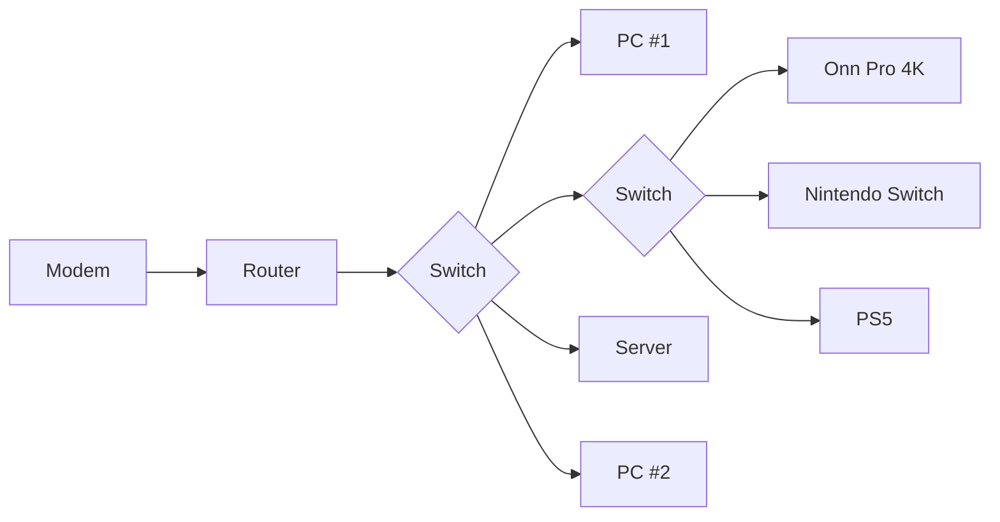

```mermaid
graph LR
  A[Modem] --> B[Router];
  B --> C{Switch};
  C --> D[PC #1];
  C --> E{Switch};
  C --> F[Server];
  C --> G[PC #2];
  E --> H[Onn Pro 4K];
  E --> I[Nintendo Switch];
  E --> J[PS5];
```
